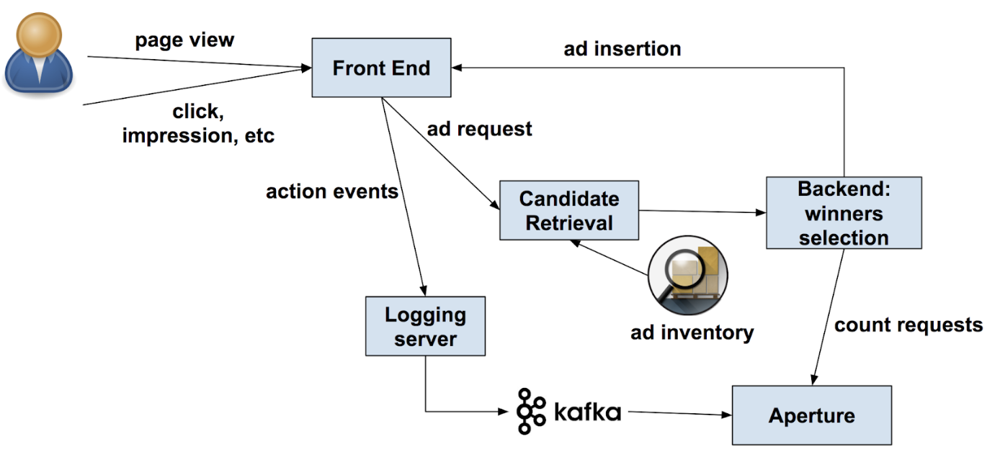

```toc

```

## Building a real-time user action counting system for ads

原文：[https://medium.com/pinterest-engineering/building-a-real-time-user-action-counting-system-for-ads-88a60d9c9a](https://medium.com/pinterest-engineering/building-a-real-time-user-action-counting-system-for-ads-88a60d9c9a)

标签：Pinterest、频次控制

为了进行频次控制和对 CTR 进行实时预测，需要对用户动作进行计数，并支持类似“Pins 1，2 和 3 上周的 impression 次数”的查询。与计数相关的架构如下，其中 Aperture 是计数服务。



Ad insertion 会将一个 insertion ID 插入到广告中，动作事件（action events）发生时，该 ID、动作（impression 或 click）以及 viewtype（home feed、search 等）会被打包成事件，传入 Kafka。

会对动作事件流去重（根据事件的 bytes），因为：

- Logging server 不保证事件的 exactly once delivery。
- 商业逻辑要求去重。

需要在完成事件 ingestion 后才计数，因为：

- 上述提到商业逻辑要求去重。
- 需要支持复杂的查询，在 ingest 阶段进行计数 precompute 的拓展性不佳。

Aperture 是一个时间序列数据存储，使用 RocksDB 作为存储引擎，使用[Rocksplicator](https://medium.com/pinterest-engineering/automated-cluster-management-and-recovery-for-rocksplicator-f1f8fd35c833)进行集群管理。SLA 为 8ms p99, 200k qps。存储结构如下：

- Key → List[EventId]
- Key = [User Id] + [Time Bucket Type] + [Time Bucket Id]
- Time Bucket Type: D(Day), H(Hour), M(Minute)
- 新的事件到达后，Aperture 会计算该事件在不同 bucket type 下的 bucket id，并往对应的三个 key 写入新的值。
