Designing Data-Intensive Applications (DDIA) 的作者 Martin Kleppmann 目前在剑桥大学担任研究员，研究重心为 CRDTs。今年 7 月，他进行了名为 "CRDTs: The Hard Parts" 的分享，介绍了 CRDTs 领域最新的研究进展，讲义、视频、参考文献列表见[信息页](https://martin.kleppmann.com/2020/07/06/crdt-hard-parts-hydra.html)。以下是我的笔记，仅供参考。

---

```toc
# This code block gets replaced with the TOC
```

## 协同软件与收敛算法

包括 Google Docs、Figma、Trello 在内的协同编辑软件，需要依赖收敛算法（convergence algorithms）使得不同节点上发生的修改可以确定地（deterministically）合并到一致的状态。最常见的收敛算法有两类：OT（Operational Transformation）和 CRDT（Conflict-free replicated data type）。

## 收敛算法之 OT

首先以 Google Docs 为例介绍 OT。server 会接收不同节点的写，按照规则调整插入的 offset，例如，将"insert ! at position 4"按照一定的规则调整为"insert ! at position 5"。


OT 的关键在于使用 server 统筹不同节点的写。OT 保证了只要两个节点接收到同一列操作，即便两列操作的顺序不同，节点上的状态也肯定收敛至相同状态。收敛是很好的性质，但收敛到的状态是否合意（desirable），还需要人为的判断，这一点对于 CRDTs 同样适用。相比 OT，CRDT 的合并是去中心化的，无需通过 server，但同样需要保证合并是合意的。

下面介绍 CRDTs 有关的四项研究进展。

## CRDTs: Interleaving anomalies

方案一：给新插入的字母分配一个位于[0,1]的数字。

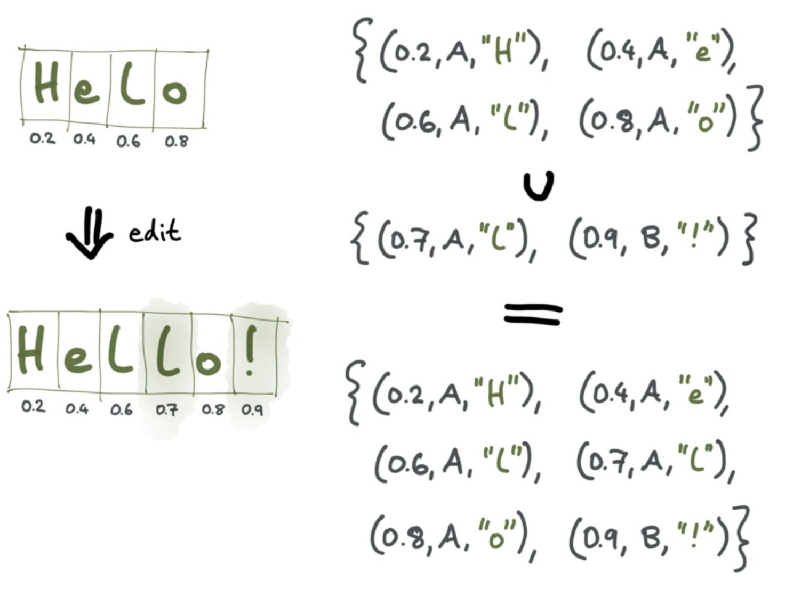

这种方法确实能保证收敛，但下面这种情况明显不是合意的收敛，其中节点 1 将"Hello!"修改为"Hello Alice!"，节点 2 将它修改为"Hello Charlie!"，可能被合并为"Hello Al Ciharcliee!"这样奇怪的结果。

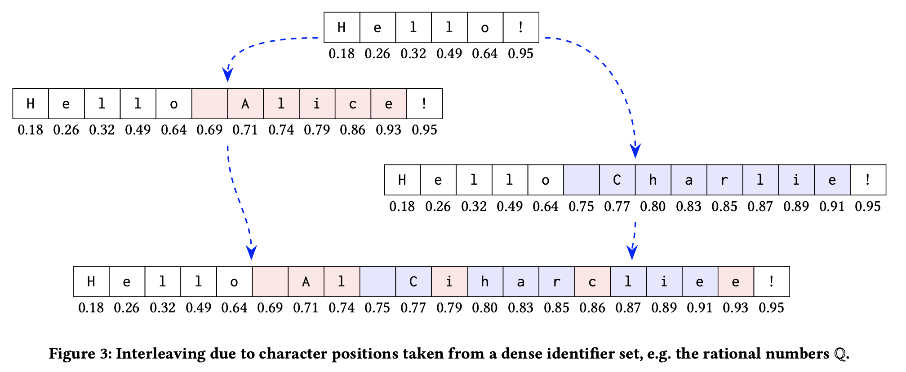

这种 interleaving 发生在很多 CRDTs（包括 Logoot、LSEQ、Astrong）实现中，而且没办法修复，因为问题根植在算法本身。

方案二：RGA。一种叫做 RGA 的 CRDT 算法存在不那么严重的 interleaving 问题。用户 2 输入的 Alice 可能被插入到用户 1 输入的 dear 和 reader 之间，原因在于 RGA 使用了一种基于时间戳的列表数据结构。

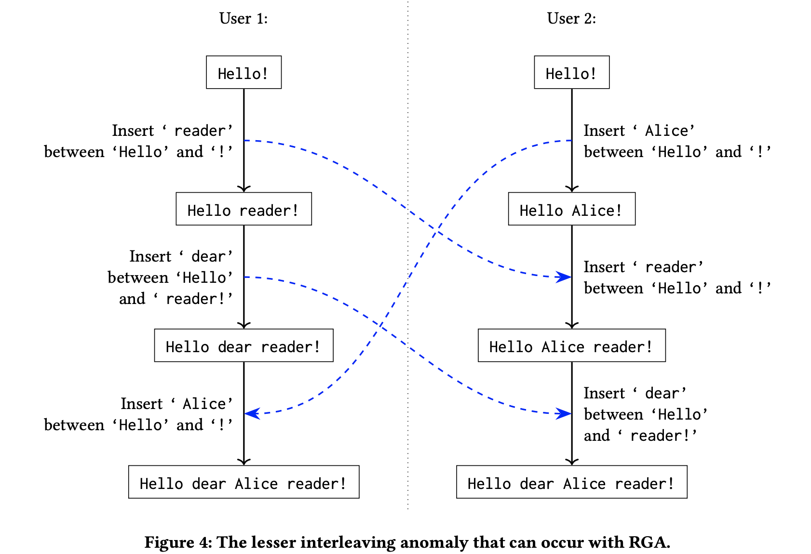

用户 1 依次输入"Hello!"、" reader"和" dear"，用户 2 依次输入"Hello!"和" Alice"。根据 RGA 算法，用户的节点上会形成一个如下的树状链表，每个节点都指向输入时该位置所位于的节点，因此"!"指向"o"，" reader"也指向"o"。算法规定，来到节点"o"后，对"o"的几个兄弟节点按照时间戳降序访问。

对于用户 1，" Alice"可能在任何时刻抵达，而发生在本地节点上的输入" dear"、" reader"和"!"的顺序是确定的且时间戳 τ4>τ2>τ1，因此合并的结果可能是：

1. 如果 τ2>τ3>τ1：Hello dear reader Alice!
2. 如果 τ4>τ3>τ2：Hello dear Alice reader!
3. 如果 τ3>τ4：Hello Alice dear reader!

其中，第二种情况是不合意的。但总体来说，比方案一可能造成的 character-by-character interleaving 要好。

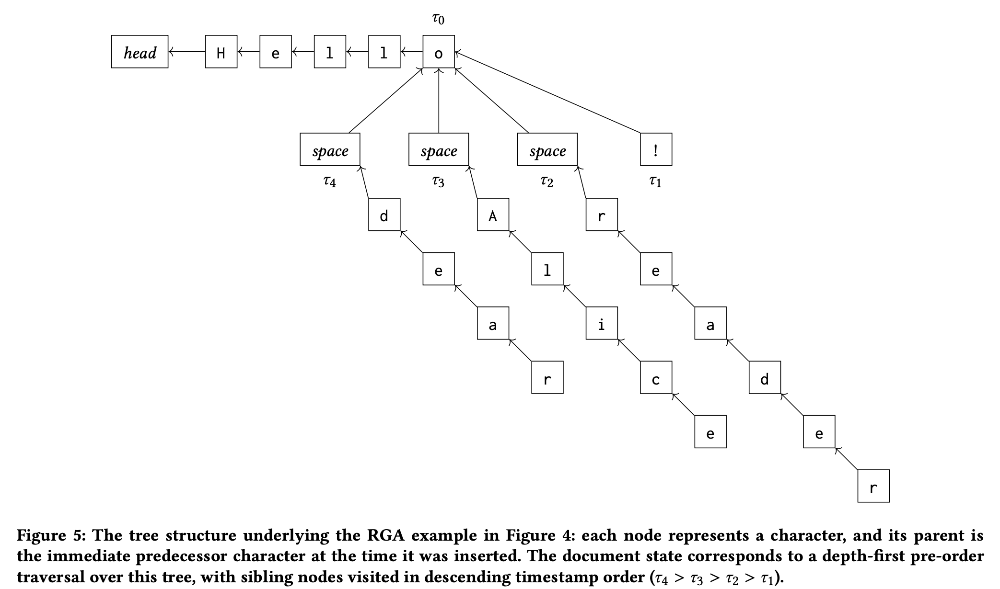

方案三：在 RGA 的基础上进行修改，杜绝了任何 interleaving 的出现，见论文 [Interleaving anomalies in collaborative text editors](https://martin.kleppmann.com/papers/interleaving-papoc19.pdf)。

## CRDTs: Moving list items

许多 CRDTs 都实现了 List 数据结构，但不支持 move 操作。用户可以把 move 拆解为 delete-then-insert。但是会发生下面的 anomaly。

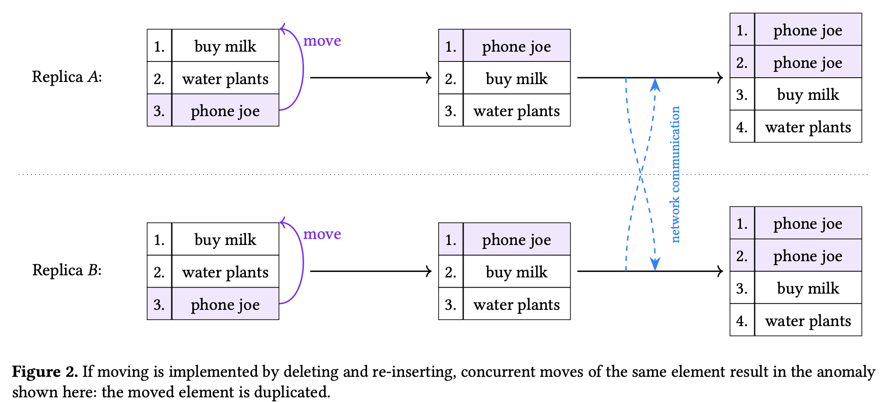

因此，我们需要一个原子性的 move 操作。

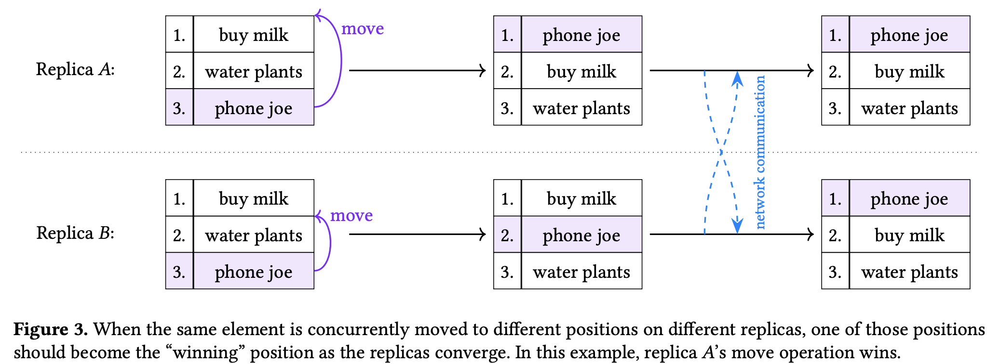

在上面这个场景中，要想合并顺利发生，需要找到一个合适的数据结构来表达 pos，让 pos 具有 last writes win 的性质，即

```go
merge(pos("phone joe") := "head of the list", pos("phone joe") := "after buy milk"))
=>
pos("phone joe") := "head of the list"
```

因此每个 list item 都要有一个 LWWRegister，并把它们放在一个 Add-Wins Set (AWSet) 中，形如 AWSet({v1: LWWRegister(p1), v2: LWWRegister(p2), ...})。此外，还要找到一个可以稳定表达 list item 位置的方法，不同的 CRDTs 使用了不同的方法。最终，普通 List CRDT + AWSet + LWWRegister = List CRDT with move operation，它可以 move 单个 list item。

如果是 move ranges of elements 呢？继续使用刚刚这个新的 List CRDT，在下面这个场景中，得不到期待的结果。理想：

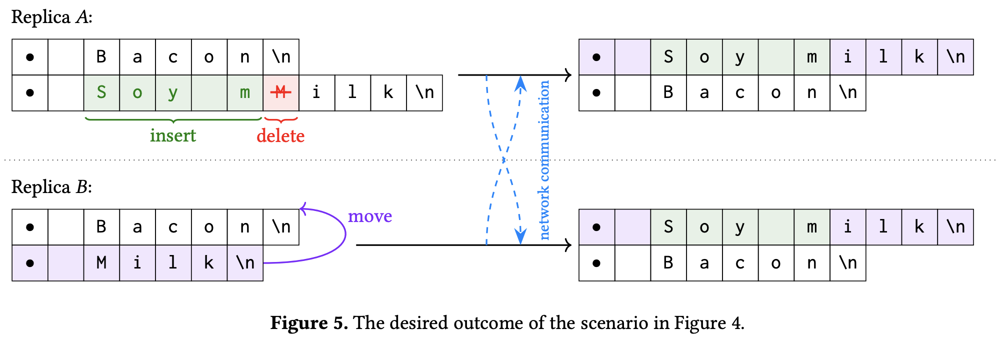

现实：


目前还没有很好解决办法。详细讨论见论文 [Moving Elements in List CRDTs](https://martin.kleppmann.com/papers/list-move-papoc20.pdf)。

## CRDTs: Moving subtrees of a tree

在一棵树内移动子树也是个很 tricky 的问题，但是这样的场景比较常见，例如文件系统就是一棵树。下面的场景有 4 种 move 结果：a 有重复，不好。b 不再是棵树，不好。c 和 d 都可以，都忽略掉其中一个 move。

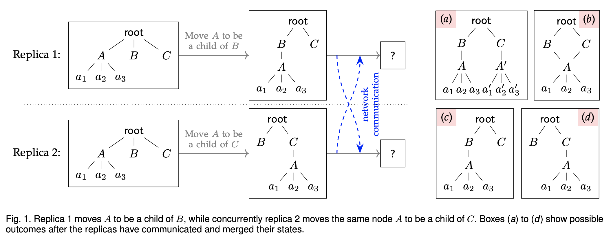

另一个场景。a 有环，不要。b 重复，不要。c 和 d 都可以。

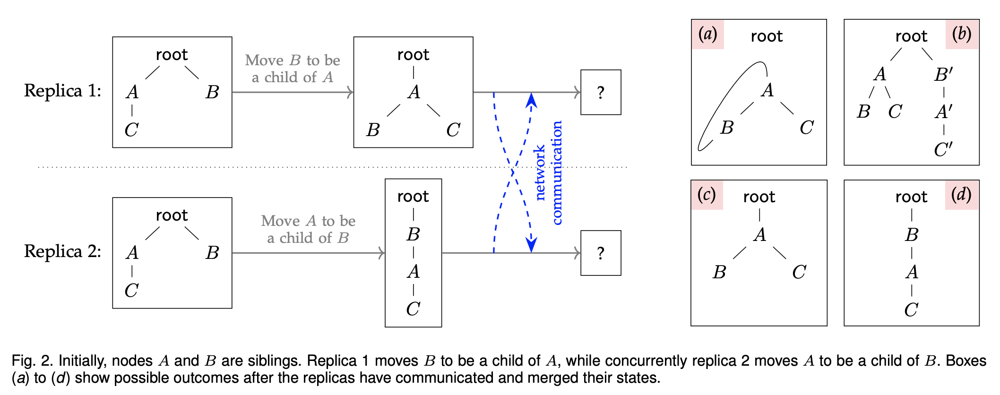

关键在于要设计出算法，使得合并的结果确定地选择 c，或者 d。一个可行的解决办法是引入操作的时间戳。在下面的例子中，要在副本 1 上合并来自副本 2 的操作序列，需要将副本 2 的操作序列逐个 move in。副本 2 中每个操作的 move in 都可能伴随副本 1 中多个操作的 undo 和 redo。在合并副本 2 的 `mv B A` 操作时，这个操作与 t=4 时发生的 `mv A B` 矛盾，被认为是 unsafe 的，选择无视。这个过程看上去非常耗时，但对于单个用户打字这样的场景，每秒 600 次 move 操作的效率是可以接受的。

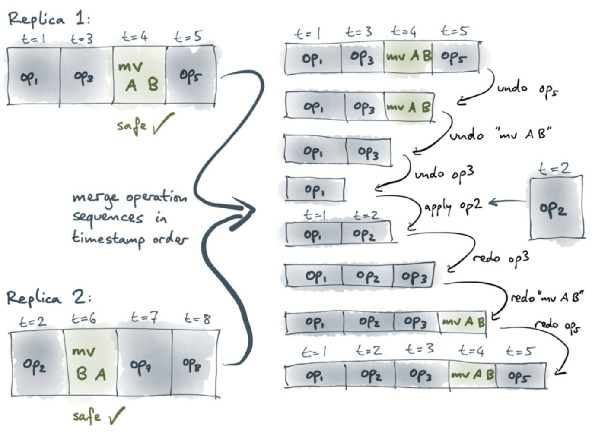

下面是具体的数据结构。LogEntry 要存更多的上下文，用于 undo 和 redo。例如，要 undo 一个 op，只需把 child 的 parent 从 newParent 设为 oldParent，meta 从 newMeta 设为 oldMeta。

```go
struct MoveOp {
  Timestamp time; // globally unique (e.g. Lamport timestamp)
  NodeID parent;  // destination of move
  Metadata meta;  // e.g. filename within parent directory
  NodeID child;   // subtree being moved
}

struct LogEntry {
  Timestamp time;           // from the move operation
  Option<NodeID> oldParent; // empty if child was previously not in the tree
  Option<Metadata> oldMeta; // empty if child was previously not in the tree
  NodeID newParent;         // from the move operation
  NodeID newMeta;           // from the move operation
  NodeID child;             // from the move operation
}
```

下面是 move 算法的形式化表达。

定义 `tree`：Tree is a set of `(parent, meta, child)` triples.

定义 `ancestor(a,b)`：称 a 是 b 的祖先，当且仅当 a 是 b 的 parent，或存在一个节点 c，使得 a 是 c 的祖先，且 c 是 b 的 parent。

```go
func doMove(move, tree) =
  if ancestor(move.child, move.parent) || move.child == move.parent {
    // unsafe, do nothing
  } else {
    // part 1, the tree without the moved child
    // part 2, the new edge created by the move
    // new tree = part 1 union part 2
    tree' = { (p, m, c) ∈ tree | c != move.child } ∪ { (move.parent, move.meta, move.child) }
  }
```

算法的关键在于要事先检查是否存在“把 parent 移到 child 下”的情况，如果是，则 do nothing，否则完成 move 操作。

Martin 还证明了 move 操作是 commutative 的，即 `applyOps(ops1) == applyOps(ops2), if ops1 is a permutation of ops2`。

详细讨论见论文 [A highly-available move operation for replicated trees and distributed filesystems](https://martin.kleppmann.com/papers/move-op.pdf)。

## CRDTs: Reducing metadata overhead

上面提到，为了完成 undo 和 redo，CRDT 需要存储很大的 metadata。在下面这个例子中，真正的文本才占 1 字节，各种 metadata 就好几十字节。

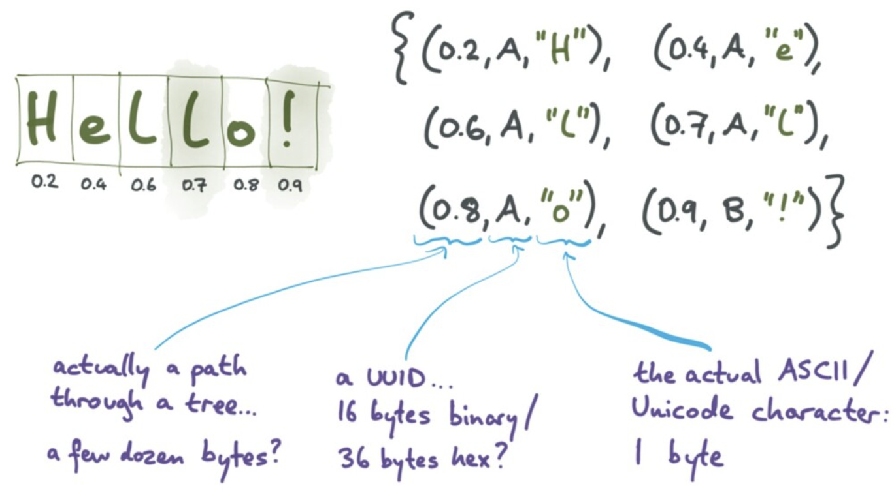

Martin 开始介绍 [automerge](https://github.com/automerge/automerge) 项目，他的 [proposal](https://github.com/automerge/automerge-perf/blob/master/columnar/README.md) 和 [PR#253](https://github.com/automerge/automerge/pull/253) 使用 columnar encoding 的思路，使得 CRDT 的 overhead 变得很小。

为了得到具体的压缩比例，Martin 团队在自己实现的一个小文本编辑器上，用 LaTeX 打了一篇学术 paper。这个文本编辑器能记录每一次键盘输入和光标移动，最终记下 300K 次键盘输入和光标移动，称为编辑历史。文本自身的体积为 100KB。下图演示了压缩优化的过程。

- 表格第一行，automerge 的 master 版本仍在使用 JSON Encoding。编辑历史的体积为 150MB，意味着每个操作花费 500B(=150MB/300K)的空间。
- 表格第二行，PR#253 使用 custom binary format（表格第二行）将体积压缩了 200 倍。之所以要强调 custom，是因为如果直接使用 protobuf 这样的通用方法，而不对数据结构本身做重新设计，只能在 JSON Encoding 的基础上压缩 2-3 倍。必须要使用非常定制化的格式才能达到 200 倍的压缩效率，下面会具体介绍这种重新设计的数据结构。
- 表格第四行，结果已经足够好。对于 100KB 的原始文本，可以用 114KB 的空间存下 gzip 后的全部编辑历史。
- 表格第五行，如果把 tombstones 挪掉，就不能进行任意的合并了。但其实 tombstones 占的体积也不大，因此留着也没什么问题。


最后，Martin 介绍了 columnar encoding 的实现。

- 下图表示了 "输入 helllo，然后删除最后一个 l" 的过程中，数据的变化情况。
- 每一次插入都记录了 predecessor 的 reference，就像 RGA 里面做的一样。
- 删除也会被记录下来，例如表格第五行。
- actor 指代操作发生的副本 ID。
- 对于 operation ID 的 counter 列，首先取 delta 得到"1,1,1,1,1,1"，随后取 run-length 得到"(6,1)"，最后用 [LEB128](https://en.wikipedia.org/wiki/LEB128) 可以压缩为 2 个字节。
- 对于 operation ID 的 actor 列，首先生成 lookup table {"A":0, "B":1}，将很长的 UUID 映射为小整数，随后取 run-length 得到"(6,0)"，最后用 [LEB128](https://en.wikipedia.org/wiki/LEB128) 可以压缩为 2 个字节。
- 对于 inserted character 的 UTF-8 列，直接做字符拼接得到"helllo"。

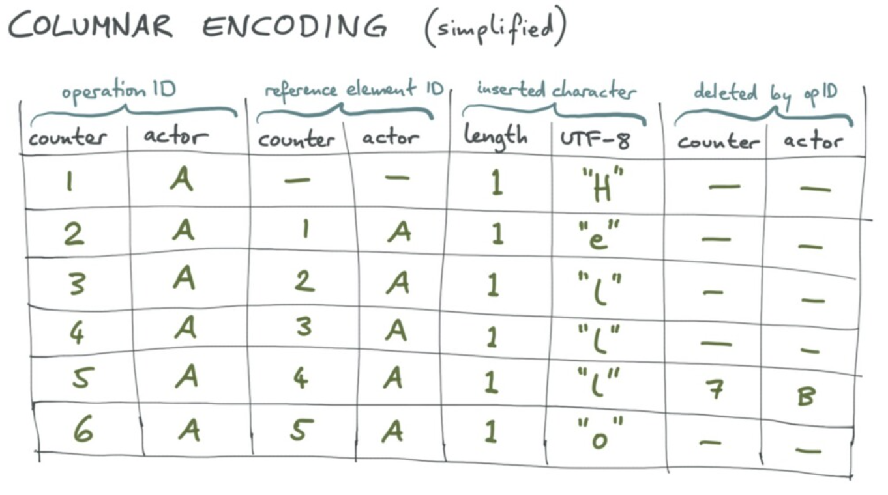

## 总结

CRDTs 的研究一直在快速推进，但目前还主要停留在原型（prototype）阶段，欢迎大家多多使用 CRDTs 搭建应用。

## 参考文献

讲义、视频、参考文献请参见[信息页](https://martin.kleppmann.com/2020/07/06/crdt-hard-parts-hydra.html)。
